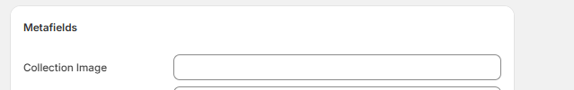
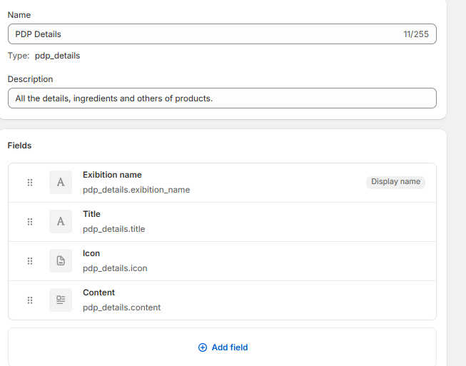

<div align="center">

<table>
  <tr>
    <td><a href="https://github.com/gabesouto/shopify-fundamentals-course-summary/blob/main/themes.md">Themes</a></td>
    <td><a href="https://github.com/gabesouto/shopify-fundamentals-course-summary/blob/main/storefront.md">Storefront API</a></td>
    <td><a href="https://github.com/gabesouto/shopify-fundamentals-course-summary/blob/main/shopify-apps.md">Apps Shopify</a></td>
    <td><a href="https://github.com/gabesouto/shopify-fundamentals-course-summary/blob/main/shopify-data-model.md">Shopify data model</a></td>
    <td><a href="https://github.com/gabesouto/shopify-fundamentals-course-summary/blob/main/shopify-graphql.md">Graphql</a></td>
    <td><a href="https://github.com/gabesouto/shopify-fundamentals-course-summary/blob/main/shopify-api.md">Shopify APIs</a></td>
    <td><a href="https://github.com/gabesouto/shopify-fundamentals-course-summary/blob/main/shopify-tools.md">Shopify Tools</a></td>
  </tr>
</table>

</div>

# Como shopify lida com dados ?

- [Liquid](#liquid)
- [Liquid Objects](#liquid-objects)
- [Como utilizar na prática um Liquid Object?](#como-utilizar-na-prática-um-liquid-object-)
- [Custom data](#custom-data)
- [Metafields](#metafields)
- [Onde definir os Metafields?](#onde-definir-os-metafields-)
- [Onde usar os Metafields?](#onde-usar-os-metafields-)
- [Valores dos Metafields](#valores-dos-metafields)
- [Metaobjects](#metaobjects)

## Liquid

 Para manipular dados a Shopify possui uma linguagem de programação, que é uma linguagem de template open-source. O Liquid é usado para carregar conteúdo dinâmico em lojas Shopify. Ele permite que você crie layouts personalizados e exiba dados da loja, como produtos, coleções e informações do cliente. <a href="https://shopify.dev/api/liquid">Documentação Liquid</a>.

## Liquid Objects

Liquid tem objetos que representam dados da loja. Esses objetos podem ser usados para acessar informações sobre produtos, coleções, clientes e muito mais. Aqui estão alguns dos principais objetos disponíveis no Liquid:

- `product`: Representa um produto na loja. Você pode acessar informações como título, preço, descrição e imagens do produto.
- `collection`: Representa uma coleção de produtos. Você pode acessar informações como título, descrição e produtos dentro da coleção.
- `cart`: Representa o carrinho de compras do cliente. Você pode acessar informações sobre os itens no carrinho, subtotal e total.
- `customer`: Representa um cliente autenticado. Você pode acessar informações como nome, e-mail e histórico de pedidos.
- `shop`: Representa a loja em si. Você pode acessar informações como nome da loja, URL e moeda.

- `order`: Representa um pedido feito por um cliente. Você pode acessar informações como número do pedido, status e itens comprados.

Existem outros objetos disponíveis no Liquid, como `page`, `blog`, `article`, entre outros. Cada objeto tem suas próprias propriedades e métodos que podem ser usados para acessar informações específicas. <a href="https://shopify.dev/api/liquid/objects">Documentação Liquid Objects</a>.

---

## Como utilizar na prática um Liquid Object ?

````liquid
<h1>{{ product.title }}</h1>
````

ao abrir a página do produto, o Liquid irá substituir `{{ product.title }}` pelo título real do produto.

também é possível usar loops e condicionais para exibir informações dinâmicas. Por exemplo, você pode usar um loop para exibir todos os produtos em uma coleção:

````liquid

  <h2>{{ product.title }}</h2>
  <p>{{ product.price | money }}</p>

````

no exemplo acima , o Liquid irá iterar sobre todos os produtos na coleção e exibir o título e o preço de cada um deles.

---

## Custom data

### Metafields

A Shopify permite que você adicione dados personalizados aos seus produtos, coleções e outros objetos usando Metafields. Os Metafields são campos adicionais que podem ser usados para armazenar informações extras que não estão incluídas nos campos padrão da Shopify. Eles podem ser usados para armazenar informações como especificações técnicas, vídeos, imagens adicionais e muito mais.

#### Onde definir os Metafields ?

- Admin da Shopify: Você pode adicionar Metafields diretamente no painel de administração da Shopify, acessando o menu de configurações do admin e selecionando  "Custom data".

### Onde usar os Metafields ?

  Primeiro é importante definir os Metafields no admin da Shopify, feito isso é necessário definir o **valor** do metafield diretamente no produto ou coleção a onde você quer usar.

  

na imagem acima, o metafield `Collection Image` foi definido no admin da Shopify e agora é possível definiar o valor dele para essa coleção específica.

## Valores dos Metafields

Você pode definir os valores dos Metafields como texto, número, URL, imagem ou JSON. Isso permite que você armazene uma ampla variedade de informações personalizadas para cada produto ou coleção.

#### Exemplo de uso de Metafields no Liquid

```liquid

  

```

No exemplo acima, o Liquid verifica se o Metafield `collection_image` existe para o produto atual. Se existir, ele exibe a imagem correspondente.

---

## Metaobjects

Metaobjects são uma evolução dos metafields no Shopify, introduzidos para permitir a criação de estruturas de dados personalizadas mais complexas e relacionais. Eles representam um sistema de gestão de conteúdo flexível dentro da plataforma Shopify.



Acima está um exemplo de como os Metaobjects podem ser usados para criar uma estrutura de dados personalizada. No exemplo, temos um Metaobject chamado `PDP Details`, que contém campos como `Title`, `Icon` e `Content`. Esses campos podem ser preenchidos com informações específicas para cada produto.

#### Exemplo do uso de Metaobjects no Liquid

```liquid

  <h2>{{ product.metaobjects.pdp_details.title }}</h2>
  
  <p>{{ product.metaobjects.pdp_details.content }}</p>

```

No exemplo acima , o Liquid verifica se o Metaobject `pdp_details` existe para o produto atual. Se existir, ele exibe o título, ícone e conteúdo correspondentes.
